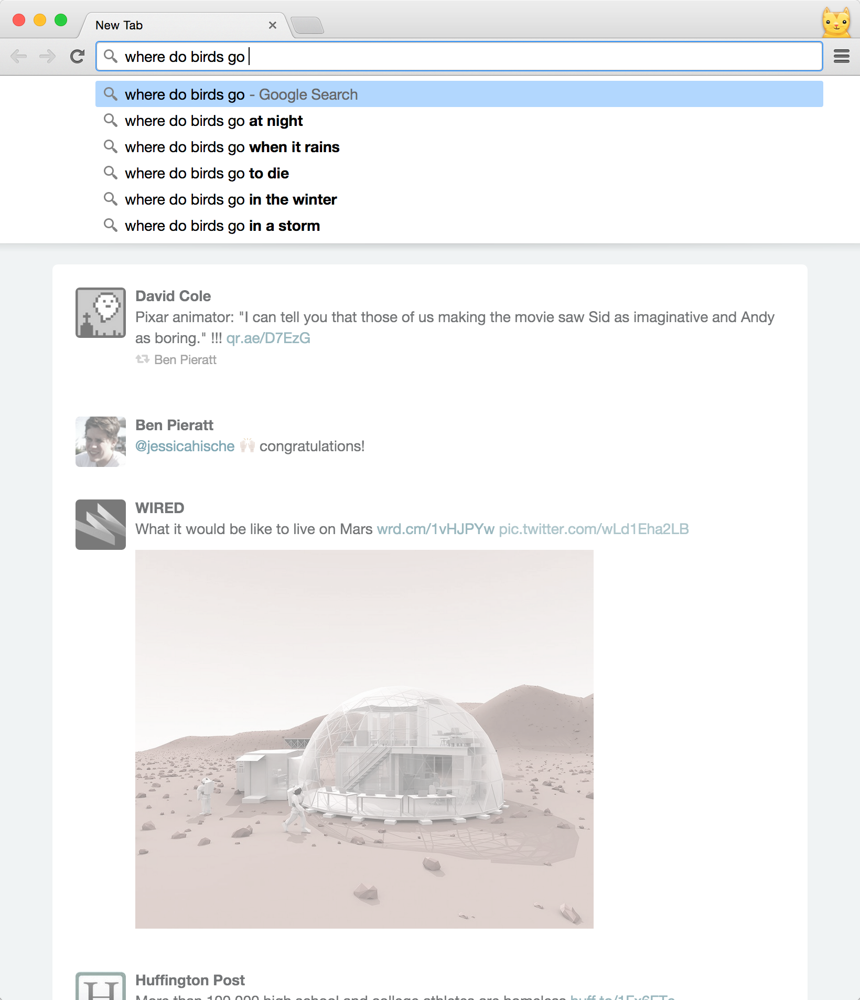

# New Tab Twitter

Chrome extension that makes the new tab page a minimally-distracting Twitter feed.

## Feed Source

At no point do you login to twitter or enter your twitter credentials.

So the twitter feed shown is not the normal timeline you see on twitter.com, instead what is displayed is a twitter list.

If you create a list containing all of the people you follow and use that list in this extension, your new tab feed will appear the same as your feed on Twitter.com.

You can use the [TwitListManager](http://twitlistmanager.com/index.php)(unaffiliated with me or this project) website to quickly add everyone you follow to your list.

This may sound like a big inconvenience because you have to remember to add/remove accounts from the list whenever you follow/unfollow them if you want your new tab feed to stay synchronizeed with your normal twitter feed.

However this same inconvenience is a feature in that you can maintain seperate feeds on twitter.com and your new tab page on purpose. For example, your twitter.com feed could just have tweets from your friends while the new tab page feed would have news twitter accounts, so you get to stay current with events but still have a personal feed on twitter.com.

Another benefit of the app sourcing from a list is that this extension is not dependant on anything other than twitter.com, there is no server for me to maintain for this to work, so it should stand the test of time better.

Additionally, since this extension takes a twitter feed already rendered by twitter and takes away certain content instead of the opposite process of generating the markup for a Twitter feed based on data from the Twitter API, updates twitter makes should require little or no updating to this extension. Additionally, there is much less potential for bugs with this setup, as Twitter's official client implementation is the least buggy.